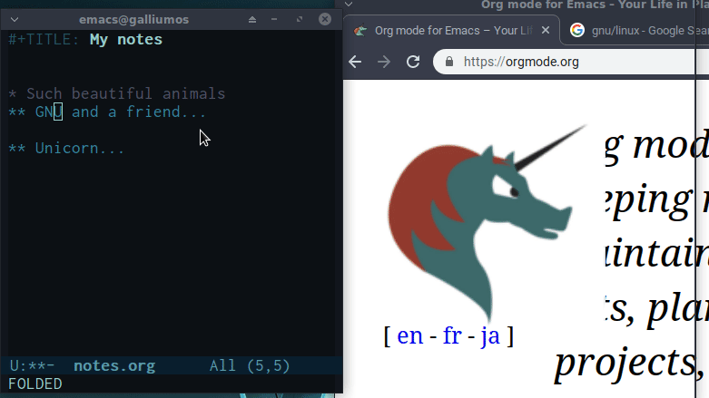

# org-ros - Rahul's Org-mode Screenshot

My implementation for the **"how do I copy-paste images into an org file?"** question.

ros is invoked with "M-x ros", then it waits for your selection, takes a screenshot and saves it as orgfileopened.org_YYYYMMDD_hhmmss.png.

It then adds a link to your org file and turns ON display-inline-images showing you the recently screenshoted image.


## Requirements
- Linux: scrot (for taking screenshots); 
- MacOS: screencapture (built-in for Mojave, Catalina, Big Sur, Monterey...)
- Emacs: 24.1

## Manual Install
Clone or download this repository.

Copy the `org-ros.el` file to a folder, like `~/.emacs.d/org-ros/`.

Add these lines to your `.emacs` file:
```
(add-to-list 'load-path "~/.emacs.d/org-ros/")
(require 'org-ros)
```

## Usage

Use `M-x org-ros RET`, select the part of the screen you want to sreenshot, and a picture file should be created and linked into your document.

## Screenshot

Here it's what it does.


